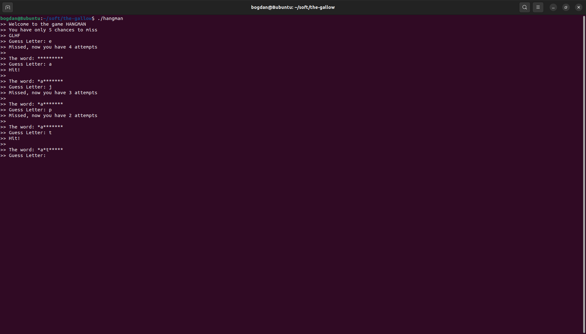

# Follow the instructions:

----
To download and start to play game, run this:
1) git clone git@github.com:BogChamp/fse_project.git
2) chmod +x prereqs.sh build.sh test.sh
3) run ./prereqs.sh
4) run ./build.sh
5) To play game: run ./hangman

To test game, run this:
run ./test.sh

How to play the game:

Input a letter. If you guessed one of word's letter, game will show letter's positions. 
Otherwise, you will lose 1 live. If you lose 5 lives, game will be ended.

----
